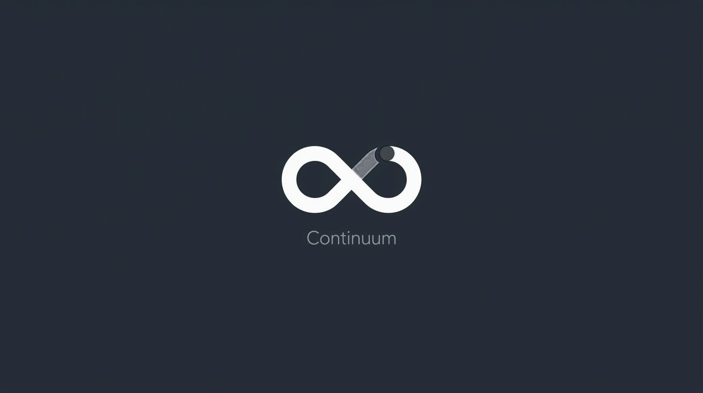
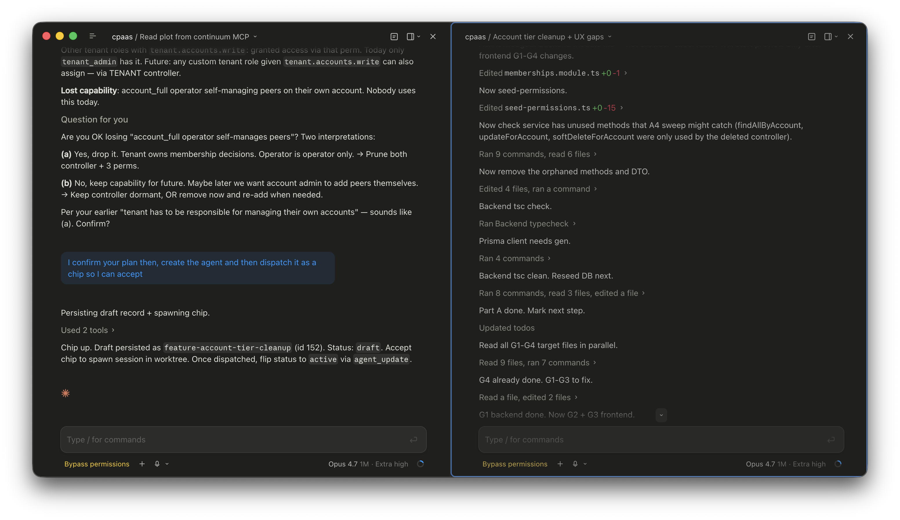
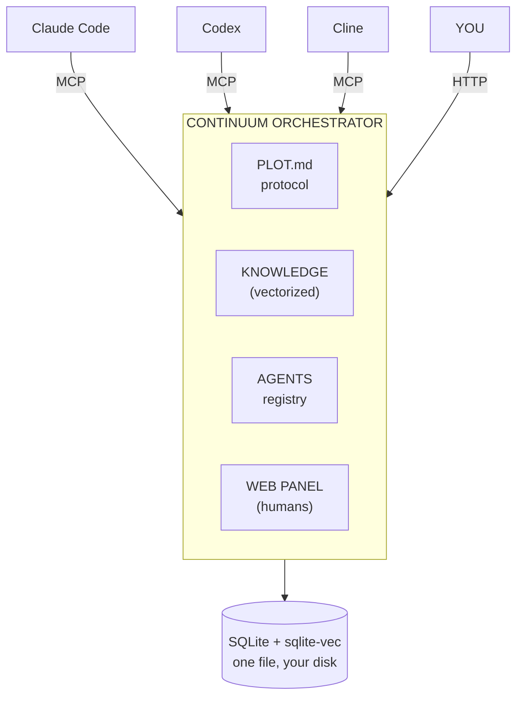
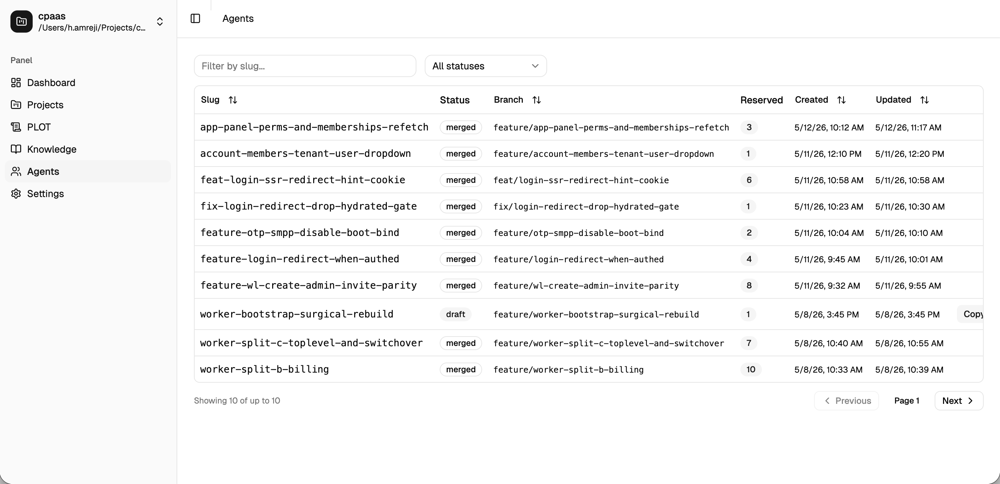
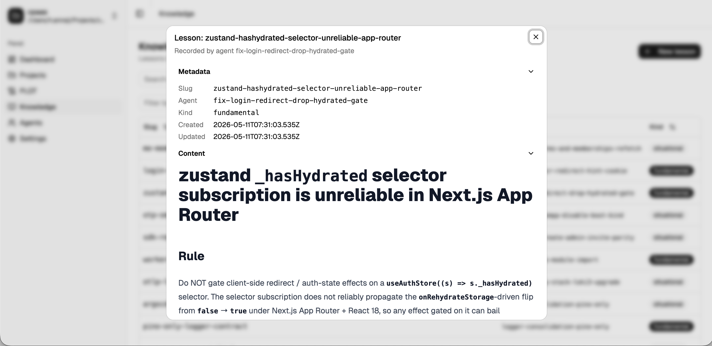

<div align="center">



### **Shared memory + orchestration for your coding agents.**

One MCP server. Tell any client to read the plot — it becomes the orchestrator. <br/>
Dispatches fresh agents in isolated worktrees, shares lessons across every Claude Code / Codex / Cline chat on the project.

[](package.json)
[](package.json)
[](https://nestjs.com)
[](https://astro.build)
[](https://github.com/asg017/sqlite-vec)
[](https://modelcontextprotocol.io)

[Quick Start](#quick-start) • [Memory & Vectors](#memory--vectors) • [Workflow](#the-workflow) • [MCP Tools](#mcp-tools) • [Wire It In](#wire-it-into-your-ai-client) • [Configuration](#configuration)



</div>

---

> **Your agents forget. Continuum remembers.**
>
> Point any MCP client at Continuum and tell it to read the plot. The client becomes an orchestrator — it researches the codebase, verifies the plan, persists a dispatch record, and hands you a ready-to-paste prompt for a fresh agent in an isolated git worktree. Every other Claude Code / Codex / Cline chat on the project sees what's reserved, shares what's been learned, and never re-explains the codebase. One local server: vector knowledge base, orchestration protocol, agent registry — shared across every MCP-speaking app on your machine.



> **No SaaS. No telemetry. No keys to manage.** Boots in seconds. Survives reboots. Scales with you.

---

## What you get

|  | |
|---|---|
| 🧠 **Vectorized memory** | Every lesson your agents learn becomes a 768-dim embedding indexed in `sqlite-vec`. Recall is semantic, fuzzy, and instant — no exact-match games. |
| 🔍 **RAG-native search** | `knowledge_search({q: "how do we handle webhook retries?"})` returns ranked metadata (slug + kind + agentSlug + timestamps); follow up with `knowledge_get({slug})` for the body. Metadata first keeps top-K context cheap; only fetch what's worth reading. |
| 🗺️ **Canonical workflow** | Every project gets a PLOT.md seeded with a 4-phase dispatch protocol — Intake → Research → Verify → Handoff. Stop re-explaining your process. |
| 🤖 **Multi-agent registry** | State machine + reserved-path tracking stops parallel agents from clobbering each other across git worktrees. |
| 📚 **Two-tier knowledge** | `fundamental` lessons are binding rules loaded on every dispatch. `situational` lessons surface via semantic search when relevant. |
| 🖥️ **Human web panel** | Astro + React UI to browse projects, agents, plot, and knowledge while AI clients drive everything via MCP. |
| 🔌 **Client-agnostic** | Standard MCP / Streamable HTTP. Works with Claude Code, Codex, Cline, Cursor, or anything that speaks the protocol. |
| 🔒 **Local-first** | One SQLite file. WAL mode. No cloud. Optional embedder is your call (Ollama, TEI, anything OpenAI-shaped). |
| 📦 **One container in prod** | Single image, one HTTP port, one mounted volume. Drop on any host, point your MCP clients at it. |

---

## Why Continuum exists

| Without Continuum | With Continuum |
|---|---|
| Session ends → context gone. | Lessons persist as embedded vectors. Recall survives reboots, models, and clients. |
| You re-explain conventions every session. | `knowledge_search` ranks lessons by relevance; `knowledge_get` pulls the body when needed. |
| Two parallel agents edit the same file. | `reserved_paths` + status state machine surfaces collisions before dispatch. |
| Each new task improvises orchestration. | PLOT.md protocol seeded into every project — Intake → Research → Verify → Handoff. |
| "What did Claude do last week?" | `registry_list` paginates dispatch metadata (slug, status, branch, reserved paths). `agent_get({slug})` pulls the full record. |
| Knowledge scattered across chat logs. | One SQLite database. One vector index. One source of truth. |

---

## Quick start

### 🐳 The easy path — one Docker command

```bash
docker compose -f docker-compose.dev.yml up
```

That's it. The whole stack comes up with hot reload, a SQLite browser, and a single shared volume — no Node, no pnpm, no native-build dance on your host machine.

What you get:

| Service | URL | What it is |
|---|---|---|
| **api** | http://localhost:6685 | NestJS + MCP server. Swagger at `/docs`. Hot-reloaded on file change. |
| **web** | http://localhost:6680 | Astro + React panel. Hot-reloaded. |
| **sqlite-web** | http://localhost:6667 | Browser UI for the live SQLite database — inspect projects, agents, knowledge, vectors. Loads `sqlite-vec` automatically. |
| **embedder** (optional) | http://localhost:8080 | Hugging Face TEI running an HTTP embedder. Off by default. |

The API embeds in-process by default (`Snowflake/snowflake-arctic-embed-m-v1.5` via Transformers.js, 768-dim, ONNX q8). No external service required for semantic search. Override via `EMBEDDER_URL` to point at any HTTP-based embedder (Ollama, TEI, OpenAI-compatible). Turn the bundled TEI container on with the `embedder` profile:

```bash
HF_TOKEN=hf_xxx docker compose -f docker-compose.dev.yml --profile embedder up
```

Bind mounts keep the source tree on your host — edits are instant. Named volumes hold `node_modules` so installs survive restarts. Database lives at `./.local-data/dev-orchestrator.db` on your host, gitignored, safe to wipe.

Stop everything:

```bash
docker compose -f docker-compose.dev.yml down            # keep data
docker compose -f docker-compose.dev.yml down -v         # nuke volumes too
```

### 🛠️ Or run on bare metal

```bash
pnpm install
pnpm dev
```

| | |
|---|---|
| API + MCP | http://localhost:7776 (Swagger at `/docs`) |
| Web panel | http://localhost:7777 |

Dev SQLite at `./.local-data/orchestrator.db`. Gitignored. Wipe to reset — next boot recreates and migrates forward.

Requires Node `>=22.12.0` and pnpm `10.33+`. The compose path skips both.

---

## Memory & vectors

This is the headline. Continuum's knowledge layer is what makes your agents stop being amnesiac.

### How a lesson becomes memory

```
agent finishes a dispatch
        │
        ▼
knowledge_create({
  project, agentSlug, slug,
  content: "When wiring rate-limit guards in Nest,
            register them in app.module.ts AFTER
            the auth guard, not before. Order matters.",
  kind: 'situational'
})
        │
        ▼
content → embedder (in-process by default, or Ollama / TEI / OpenAI-compatible)
        │       Snowflake Arctic Embed v1.5 → 768-dim vector
        ▼
SQLite row + sqlite-vec index entry
        │       freshness profile = (URL, model, dim)
        ▼
forever queryable by ANY future agent on this project
```

### How recall works

Phase 1 of every dispatch (the orchestrator does this automatically):

```
knowledge_list({ project, kind: 'fundamental' })
  └─ returns metadata for every binding lesson — slug + agentSlug + timestamps.
knowledge_get({ project, slug })  // for each fundamental slug
  └─ full body — base branch, worktree convention, no-AI-attribution, etc.

knowledge_search({ project, q: "rate limit middleware nest interceptor order" })
  └─ vector similarity over your prose
  └─ returns top-K ranked metadata (no content)
  └─ does NOT need exact wording — natural language works
knowledge_get({ project, slug })  // for each relevant hit
  └─ pulls the full lesson body
```

Search and list return metadata only — slug + kind + agentSlug + timestamps. Call `knowledge_get` for the body of any lesson worth reading. Keeps top-K context cheap; the orchestrator triages first, fetches second.

The result: the agent that's about to plan your task already knows what your last five agents learned the hard way. No prompt engineering. No "here's our convention" copy-paste.

### Two kinds of knowledge

| Kind | Loaded when | Use for |
|---|---|---|
| `fundamental` | Every dispatch, unconditionally | Project-wide rules: base branch, worktree naming, commit conventions, append-only files |
| `situational` | Only if semantically relevant to the task | Specific gotchas: "auth guard ordering," "regen artifact merge strategy," "Stripe webhook idempotency keys" |

### The freshness profile

Vectors are pinned to a `(EMBEDDER_URL, EMBEDDER_MODEL, EMBEDDER_DIM)` triple. Change any one and Continuum marks stale vectors for rebuild on next boot. You stay in control of which embedder owns your memory — local Ollama, self-hosted TEI, or anything OpenAI-shaped.

### Pluggable embedders

The embedder is required and runs in-process by default (`Snowflake/snowflake-arctic-embed-m-v1.5`, 768-dim, ONNX q8). The model weights are bundled in the API image — no extra container, no extra config, semantic search works out of the box.

Override via `EMBEDDER_URL` to delegate embedding to an HTTP service:

```bash
# Option A — Ollama (simplest, fully local)
ollama pull <embedding-model>
# EMBEDDER_URL=http://127.0.0.1:11434/api/embed
# EMBEDDER_MODEL=<embedding-model>   EMBEDDER_DIM=768

# Option B — Hugging Face TEI (production-grade, batched)
HF_TOKEN=hf_xxx docker compose -f docker-compose.dev.yml --profile embedder up embedder
# EMBEDDER_URL=http://127.0.0.1:8080/v1/embeddings
# EMBEDDER_MODEL=<repo-id>   EMBEDDER_DIM=768

# Option C — anything OpenAI-compatible /v1/embeddings
# Works out of the box. Match the dim.
```

### Built on `sqlite-vec`

The vector index lives in the same SQLite file as your projects, agents, and plot. One file. One backup. One restore. No separate vector DB to provision, no Pinecone bill, no Chroma daemon to babysit. WAL mode keeps reads concurrent with writes; foreign keys keep your registry consistent; `busy_timeout = 5000` keeps things calm under contention.

---

## Wire it into your AI client

### Claude Code

```jsonc
// ~/.claude.json  →  mcpServers
{
  "mcpServers": {
    "continuum": {
      "transport": "streamable-http",
      "url": "http://127.0.0.1:7776/mcp"
    }
  }
}
```

Restart Claude Code. Tools appear under `mcp__continuum__*`.

### Codex

```toml
# ~/.codex/config.toml
[mcp_servers.continuum]
transport = "streamable-http"
url = "http://127.0.0.1:7776/mcp"
```

### Anything else (Cline, Cursor, custom)

Point any MCP-compatible client at `http://127.0.0.1:7776/mcp`. Streamable HTTP, stateful sessions (UUID-keyed). Server name `continuum`.

---

## Your first project

Inside any wired client:

```
Create a Continuum project for /absolute/path/to/my/repo,
then read the PLOT.md and act as orchestrator
for the following task: <describe what you want done>.
```

What happens:

1. Client calls `project_create({project: "/absolute/path/..."})`
2. Server seeds PLOT.md (the orchestration protocol) and an empty knowledge base
3. Client calls `plot({project})`, reads the protocol, enters orchestrator mode
4. Client follows the 4-phase workflow — researches, verifies, persists a dispatch record, hands you a ready-to-paste prompt for a fresh agent in a git worktree

You paste the prompt into a new Claude Code / Codex session. That agent codes inside an isolated worktree against its reserved paths. Other parallel agents see the new agent's reservations via the coordination brief.

When work merges, the orchestrator records what was learned via `knowledge_create` — and **every future dispatch on this project benefits from it forever**.

---

## The workflow

### 1. Intake

```
registry_list({project, status:'active'})     // paginated metadata: slug + reservedPaths + timestamps
agent_get({project, slug})                    // bodies (request/plan/implPrompt/coordinationBrief) per active agent
knowledge_list({project, kind:'fundamental'}) // binding-rule metadata
knowledge_get({project, slug})                // body per fundamental slug — read every one
knowledge_search({project, q: "<task intent>"}) // RAG → ranked metadata
knowledge_get({project, slug})                // body for each relevant hit
```

### 2. Research

Spawn an `Explore` / `Plan` subagent. It reads the codebase against the loaded knowledge. Produces a file-by-file plan: create / modify / delete. **Plan only — no code.**

### 3. Verify

Spawn a critique agent. It challenges every file touched, looks for orphans and broken call sites, cross-checks against active agents' reserved paths. Returns annotated deltas.

### 4. Handoff

```
agent_create({
  project, slug, branch, worktree,
  reservedPaths,        // paths this agent owns
  request,              // verbatim human task
  plan,                 // final agreed plan
  implPrompt,           // self-contained prompt for the dispatched agent
  coordinationBrief,    // short block for every other active agent
})
```

Agent lands as `draft`. Promote with `agent_update({status:'active'})` when you dispatch. On merge, record the SHA and bank the lesson:

```
agent_update({ project, slug, status:'merged', mergedCommit, postMergeNotes })
knowledge_create({ project, agentSlug, slug, content, kind:'situational' })
```

The orchestrator never edits source, runs regen, merges branches, or pushes commits. It researches, verifies, coordinates, and persists. Code lives in fresh agents inside isolated worktrees.

---

## MCP tools

Every tool takes `project` (canonical absolute path) as its first argument.

### Project

| Tool | Purpose |
|---|---|
| `project_list` | Enumerate registered projects |
| `project_get` | Fetch one project |
| `project_create` | Register project, seed PLOT.md + knowledge |
| `project_rename` | Rename a project |
| `project_delete` | Cascade delete (project + agents + lessons) |

### Plot — the orchestration protocol

| Tool | Purpose |
|---|---|
| `plot` | Read PLOT.md |
| `plot_update` | Apply a unified git-format diff (zero fuzz, exact context match) |

`plot_update` validates `--- a/PLOT.md` / `+++ b/PLOT.md` / `@@` headers strictly. Context mismatch throws `hunk_mismatch` with the failing hunk header. Re-read with `plot`, regenerate the diff, retry. No silent overwrites.

### Knowledge — the vector memory

| Tool | Purpose |
|---|---|
| `knowledge_list` | Lesson metadata (slug, kind, agentSlug, timestamps). Optional `kind` filter. **No content.** |
| `knowledge_search` | Semantic query → ranked metadata. `q` free-text intent, optional `kind`, optional `limit`. **No content.** |
| `knowledge_get` | Read one lesson by slug — full body |
| `knowledge_create` | Record a new lesson — `kind: 'fundamental' \| 'situational'`. Embedded automatically. |
| `knowledge_update` | Replace lesson content. Re-embeds on save. |
| `knowledge_delete` | Retire a lesson |

`knowledge_search` runs vector lookup over the `sqlite-vec` index. Pass natural prose — questions, task statements, descriptions all work. SQL wildcard syntax does not. Response is ranked metadata; call `knowledge_get({project, slug})` for the body of any hit worth reading. Same pattern for `knowledge_list` (use `kind: 'fundamental'` to enumerate the binding set, then get each).

### Agents

| Tool | Purpose |
|---|---|
| `registry_list` | Paginated agent metadata — `{data, page, limit, hasNextPage}`. Each `data` row: slug, status, branch, worktree, reservedPaths, timestamps, mergedCommit, abandonedReason. Optional `status` filter; default `limit` 10, max 50. **No artifact bodies.** |
| `agent_get` | Full record by slug — includes request, plan, implPrompt, coordinationBrief, postMergeNotes |
| `agent_create` | Persist a draft dispatch record |
| `agent_update` | Transition status, edit fields |

Allowed transitions: `draft → active → merged | abandoned`. `merged` requires a 7–40 char commit SHA. `abandoned` requires a reason. Only `active` agents reserve paths.

`registry_list` returns the collision matrix metadata in one paginated envelope. To inspect a dispatch's plan or implPrompt, follow with `agent_get({project, slug})`. Page through with `page` until `hasNextPage` is false.

---

## Example session

```
human: orchestrate adding rate-limit middleware to /api routes

claude: → registry_list({project, status:'active'})  // 0 active
        → knowledge_list({project, kind:'fundamental'})
                                              // metadata for binding rules
        → knowledge_get({project, slug:'base-branch'})       // → main
        → knowledge_get({project, slug:'worktree-convention'}) // → ../<slug>/
        → knowledge_search({project, q:'rate limit middleware nest interceptor'})
                                              // ✨ 2 ranked hits on guard ordering (metadata)
        → knowledge_get({project, slug:'rate-limit-guard-ordering'}) // bodies fetched
        → spawn Plan subagent → plan returned
        → spawn critique subagent → 1 issue: missed `app.module.ts` registration → fixed
        → agent_create({
            slug: 'rate-limit-middleware',
            branch: 'feature/rate-limit',
            worktree: '/abs/path/../rate-limit-middleware',
            reservedPaths: ['apps/api/src/common/rate-limit/**', 'apps/api/src/app.module.ts'],
            request: 'orchestrate adding rate-limit middleware to /api routes',
            plan: '...',
            implPrompt: '...',
            coordinationBrief: 'reserves common/rate-limit/**, edits app.module.ts (additive)'
          })
        → here's the impl prompt to paste into a fresh session: ...

[ task ships ]

claude: → agent_update({slug:'rate-limit-middleware', status:'merged', mergedCommit:'a1b2c3d'})
        → knowledge_create({
            agentSlug: 'rate-limit-middleware',
            slug: 'rate-limit-guard-ordering',
            kind: 'situational',
            content: 'Rate-limit guards must register AFTER auth guard in app.module.ts.
                      Order in providers array decides execution order. Reverse → 401s
                      bypass rate limiting.'
          })
        // ✅ lesson embedded → vector indexed → permanent memory
```

Next time anyone — you, Claude, Codex — touches anything rate-limit-shaped on this project, that lesson surfaces automatically.

---

## Web panel





Astro 6 + React 19 islands. Tailwind v4. shadcn/ui.

| Page | What |
|---|---|
| `/` | Landing |
| `/projects` | Projects list — TanStack Table, sortable, filterable |
| `/agents` | Registry / status board across projects |
| `/knowledge` | Markdown viewer — GFM, syntax highlight, anchored sections, search |
| `/plot` | Plot viewer + editor with diff preview |
| `/settings` | Embedder URL + model + dim, tokenizer key, REST gate, log level |

Settings stored in `app_settings` (SQLite) override env vars. Headless deploys still work via env alone.

---

## Configuration

Both env vars and panel settings supported. Panel takes precedence.

| Var | Default | Purpose |
|---|---|---|
| `PORT` | `7776` | HTTP port |
| `CORS_ORIGIN` | _unset_ | `*` or comma-separated origins |
| `ORCHESTRATOR_DB_PATH` | `/data/orchestrator.db` | SQLite path. Dev scripts override to `./.local-data/orchestrator.db` |
| `PANEL_REST_ENABLED` | `false` | Mount `/api/orchestrator/*` REST surface (panel uses it) |
| `NODE_ENV` | _unset_ | Production blocks destructive migrations |
| `ORCHESTRATOR_ALLOW_DESTRUCTIVE_MIGRATE` | _unset_ | Set `1` to override in production |
| `ANTHROPIC_API_KEY` | _unset_ | Token-count endpoints (server-side only) |
| `ANTHROPIC_TOKENIZER_MODEL` | `claude-opus-4-7` | Model name for `count_tokens` |
| `EMBEDDER_URL` | _unset_ | HTTP embedding endpoint (Ollama / TEI / OpenAI-compatible). Unset → in-process embedder |
| `EMBEDDER_MODEL` | `Snowflake/snowflake-arctic-embed-m-v1.5` | Model id (in-process default; passed through to HTTP embedder when configured) |
| `EMBEDDER_DIM` | `768` | Expected embedding dimension |

---

## Stack

| Layer | Tech |
|---|---|
| **Memory** | `sqlite-vec` vector index • Snowflake Arctic Embed v1.5 in-process via Transformers.js (default) • Ollama / TEI / OpenAI-compatible embedders via `EMBEDDER_URL` • freshness-pinned vectors |
| API | NestJS 11 • `@rekog/mcp-nest` • `@modelcontextprotocol/sdk` 1.10 • Zod 4 • Swagger |
| Persistence | `better-sqlite3` (WAL, FK, busy_timeout 5s) |
| Diff engine | `diff` 9 (zero-fuzz unified-diff applier) |
| Web | Astro 6 • React 19 • Tailwind 4 • shadcn/ui • TanStack Table • rehype/remark • highlight.js |
| Tooling | Turborepo 2 • pnpm 10.33 • TypeScript 5.9 • Prettier 3 • Jest |

---

## Scripts

```bash
pnpm dev          # turbo run dev — api + web in watch
pnpm build        # turbo run build
pnpm lint         # turbo run lint
pnpm check-types  # turbo run check-types
pnpm format       # prettier across ts/tsx/js/astro/md/json

pnpm -F @continuum/api dev          # api only — nest start --watch
pnpm -F @continuum/api mcp:dev      # api with local SQLite at .local-data/
pnpm -F @continuum/api test         # jest unit tests
pnpm -F @continuum/api test:e2e     # jest e2e

pnpm -F @continuum/web dev          # web only — astro dev
pnpm -F @continuum/web build        # astro build → dist/
```

---

## Conventions

- **`project` is always a canonical absolute path.** Pass the project root, never a worktree subdirectory. Worktree paths throw `project_not_found`.
- **Plot mutations flow through unified diffs.** No full-text writes. Bad context → server rejects with the failing `@@` header.
- **Knowledge updates are whole-content replace.** Pass the full new `content`. Re-embedded on save.
- **Reserved paths are JSON arrays of globs.** Only `active` agents reserve.
- **Migrations are forward-only on boot.** Production blocks destructive migrations unless explicitly opted in.

---

## Troubleshooting

| Symptom | Likely cause |
|---|---|
| `project_not_found` | Passing a worktree path. Use the canonical project root registered with `project_create`. |
| `hunk_mismatch` from `plot_update` | Stale diff. Re-read with `plot`, regenerate against current content, retry. |
| `knowledge_search` / `knowledge_list` returns empty / weird results | Embedder unreachable, model mismatch, or dim mismatch (search only). Check `/settings`. Backfill stale vectors. Remember: both return metadata — call `knowledge_get({project, slug})` for the body. |
| Vectors not regenerating after embedder swap | Freshness profile (URL + model + dim) must change. Restart server to trigger backfill. |
| `invalid_transition` from `agent_update` | Allowed: `draft → active → merged \| abandoned`. Anything else throws. |
| `missing_merged_commit` / `invalid_merged_commit` | `merged` requires a 7–40 char SHA. |
| Schema migration refuses in production | Set `ORCHESTRATOR_ALLOW_DESTRUCTIVE_MIGRATE=1` if you really mean it. |

---

## Roadmap

- [ ] Cross-project knowledge sharing (`kind: 'global'`)
- [ ] Embedding re-rank with a small reranker model
- [ ] One-shot import of existing CLAUDE.md / AGENTS.md / Cursor rules → fundamentals
- [ ] Read-only public knowledge mirror (publish a project's lessons as a static site)
- [ ] Built-in observation hooks for SessionStart / SessionEnd events

---

## Contributing

Contributions welcome. Fork, branch, test, PR. Match Prettier defaults (100-col, double quotes, semicolons, ES5 trailing commas). Keep MCP tool changes Zod-typed.

---

## Support

| | |
|---|---|
| Issues | GitHub Issues |
| Docs | this README + Swagger UI at `/docs` + the seeded PLOT.md inside each project |
| MCP spec | https://modelcontextprotocol.io |

---

<div align="center">

### Stop letting your agents forget.

**`pnpm install && pnpm dev`** — and they never will again.

</div>
